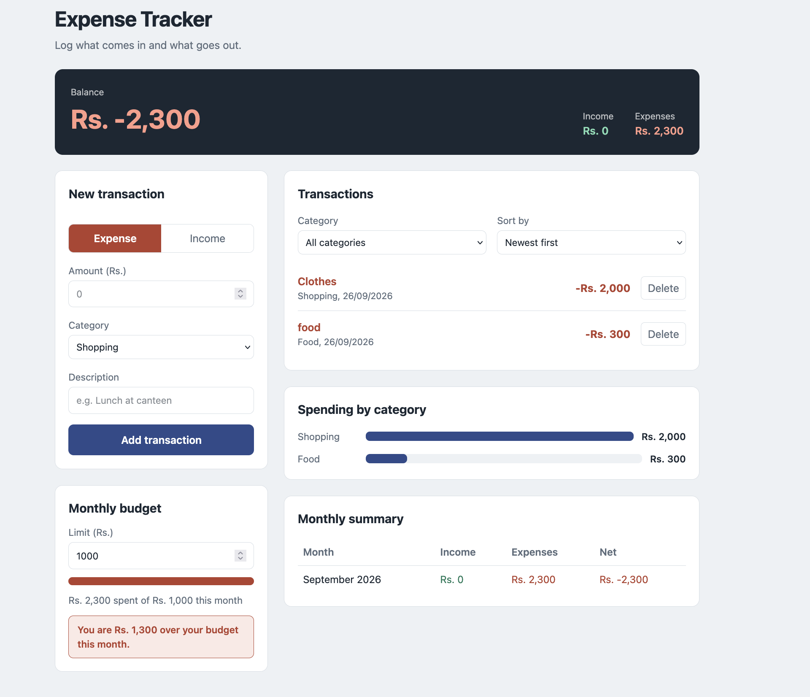
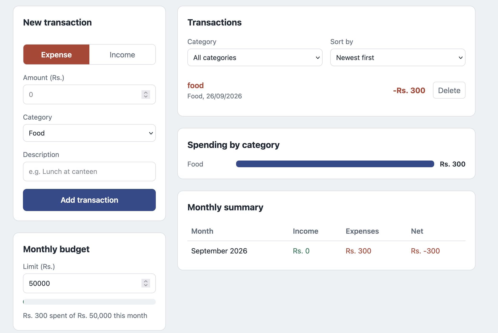
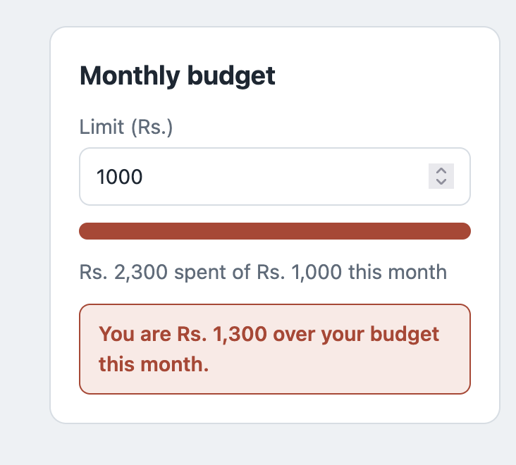

# Expense Tracker Web Application

A modern, responsive single-page React application built with Vite and CSS for tracking personal income and expenses. The application features real-time balance calculations, monthly budget limits, interactive spending charts, transaction filtering, and persistent browser local storage.

---

## 🚀 Features Implemented
- **Transaction Logging**: Add income or expense transactions with amount, category, description, and date.
- **Real-Time Financial Dashboard**: Displays total income, total expenses, and current net balance dynamically.
- **Budget Limit Monitoring**: Set monthly spending limits with visual progress bars and warning alerts when exceeded.
- **Interactive Visual Analytics**: Category-wise spending breakdown charts and monthly financial summaries.
- **Advanced Filtering & Sorting**: Filter transactions by category or search term, and sort by date or amount.
- **Local Storage Persistence**: Custom `useLocalStorage` hook ensures all data persists across browser reloads.
- **Responsive UI**: Mobile-first responsive design with clean typography and modern styling.

---

## 🛠️ Technologies & Libraries Used
- **Frontend Framework**: React 18 (Functional Components, Custom Hooks)
- **Build Tool**: Vite
- **Styling**: Vanilla CSS3 (CSS Variables, Flexbox, Grid, Responsive Media Queries)
- **State & Storage**: React State (`useState`, `useEffect`) and Browser `localStorage` API

---

## 📦 Setup & Installation Instructions

To run this application locally on your machine, follow these steps:

1. **Clone the repository**:
   ```bash
   git clone https://github.com/Snorlax2007/expense-tracker.git
   cd expense-tracker
   ```

2. **Install dependencies**:
   ```bash
   npm install
   ```

3. **Start the development server**:
   ```bash
   npm run dev
   ```

4. **View in browser**: Open `http://localhost:5173` (or the URL shown in your terminal).

---

## 🖼️ Application Screenshots


*Figure 1: Main Dashboard with Balance Summary and Transaction Form*


*Figure 2: Spending Breakdown Chart and Filterable Transaction History*


*Figure 3: Budget Exceeded Warning and Responsive Mobile View*

---

## ⚠️ Known Limitations & Future Enhancements
- **Transaction Editing**: Current version supports deleting transactions; direct inline editing can be added in a future update.
- **Budget Scope**: Budget limits currently apply to the active calendar month.
